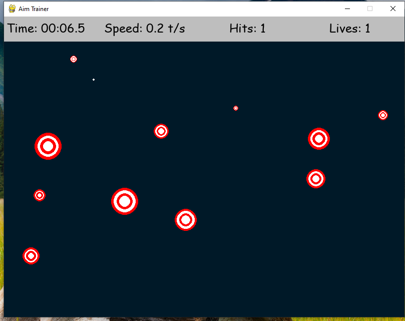
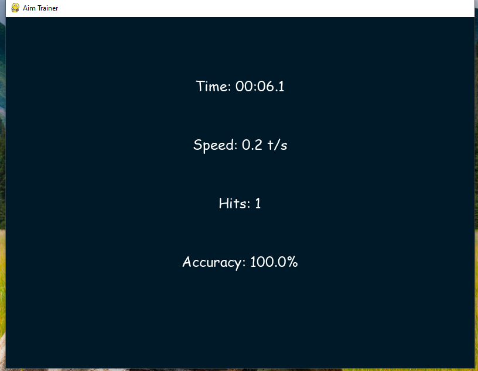

# 🎯 Aim Trainer Game

[](https://www.linkedin.com/posts/eromosele-itoya_python-pygame-gamedev-activity-7349058650138632195-FRHu?utm_source=share&utm_medium=member_desktop&rcm=ACoAAEbDOGsBGINDr5uoWo3fkmNHZc_HI1Qst6k)

A fun, interactive Aim Trainer game built with Python and Pygame. Test your mouse accuracy and reaction speed by clicking targets before they disappear. You’ve got 3 lives—don’t let them slip away!

## Features ✨
- 🎯 Dynamic Targets: Grow and shrink to challenge your timing
- 💔 Lives System: Start with 3 lives, lose one per miss
- 📊 Real-Time Stats: Track time played, speed (targets/sec), hits, and lives
- 🖥️ Smooth UI: Beautiful design for seamless play

## Screenshots 📸
|  Game in Progress | Final Result   |
|------------------|----------------|
|  |  |

- Game Screen: Click targets before they shrink to zero!
- Game Over Screen: Check your final stats and accuracy.

## How to Play 🎮
1. Launch the game (see installation below).
2. Click targets as they appear on-screen.
3. Each target grows to a max size, then shrinks miss it, and lose a life.
4. Start with 3 lives; lose them all, and it’s game over!
5. Watch your stats in the top bar: time, speed, hits, and lives.

## Installation ⚙️
1. Make sure you have Python 3 installed: Download Python
2. Install Pygame:
```bash
pip install pygame
```

3. Clone the repo:
```bash
git clone https://github.com/youngdrizzy1/aim-trainer
cd aim-trainer
```

4. Run the game:
```bash
python aim_trainer.py
```

## Tech Stack 🛠️
- Language: Python 3
- Library: Pygame for game development

## Known Issues ⚠️
- Designed for desktop; not mobile-friendly.
- Best experience at 800x600 resolution or higher.

## Connect with Me 👋
[LinkedIn](https://www.linkedin.com/in/eromosele-itoya/) | 
[GitHub](https://github.com/youngdrizzy1)
